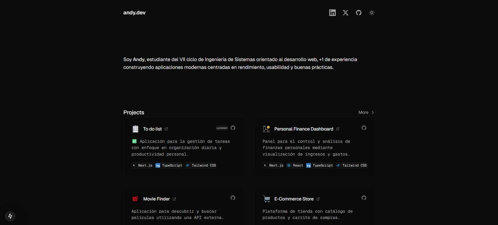
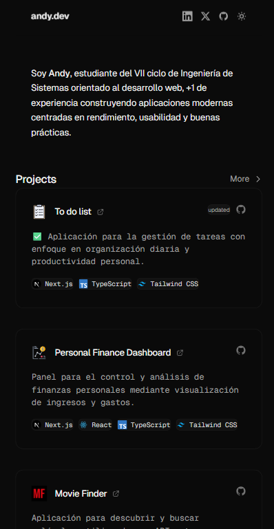

# 💻 Personal Portfolio – Andy Avendaño

Modern and minimalist web portfolio built with Next.js, React, TypeScript, and Tailwind CSS.
This project showcases my frontend skills with a focus on clean layout, responsive design, and reusable components.

---

## ✨ Live Demo

🔗 Live Demo: https://andydevsoftware.vercel.app/




---

## 🚀 Features

### 🎨 Design & UX

Minimalist design with content-first approach
Light/dark theme with localStorage persistence
Smooth animations and micro-interactions
Gradient hover effects on project cards
Fully responsive (mobile-first)
Geist Sans & Geist Mono typography

### 📱 Interactive Header

Sticky header with backdrop blur
Smooth transition on scroll
Social media links (LinkedIn, Twitter, GitHub)
Theme toggle with animated icons
Adaptive design for mobile devices

### 💼 Projects Section

Responsive grid of featured projects
Spotlight effect that follows cursor
Status badges (updated, in development)
Direct links to demo and repository
Technology tags with icons
Horizontal scroll on mobile for tags

### 👨‍💻 Work Experience

Visual timeline with connection line
Clearly defined work periods
Company links
Detailed responsibility descriptions
Clean and easy-to-read design

### 🛠 Technologies

Technology grid with categories
Technology icons
Hover effects on cards
Organized by Frontend, Language, Styling, Database, Tools
Color inversion in light mode for better contrast

### 📄 Footer

Adaptive desktop/mobile layout
Site build information
Dynamic copyright with current year
Centered design on mobile

---

## 🧠 Project Structure

```
src/
├── app/
│ ├── globals.css         # Global styles & theme
│ ├── layout.tsx         # Root layout & metadata
│ └── page.tsx           # Main page
│
└── components/
├── Header.tsx               # Sticky header with theme toggle
├── Intro.tsx                # Introduction section
├── Projects.tsx             # Project grid with effects
├── Experience.tsx           # Work experience timeline
├── Technologies.tsx         # Technologies grid
├── Footer.tsx               # Responsive footer
└── ThemeProvider.tsx        # Global theme context
```

---

## ⚙️ Tech Stack

- Next.js 15 - React Framework
- React 19 - UI Library
- TypeScript - Static typing
- Tailwind CSS v4 - Utility-first styling
- Geist Font - Modern typography
- localStorage API - Theme persistence

## 🧩 Key Implementation Details

### Theme Management

- React Context API for global theme state
- localStorage persistence
- Smooth transitions between themes
- Custom CSS variables for each theme

### Visual Effects

- Spotlight effect using CSS variables (--x, --y)
- Radial gradients that follow cursor
- CSS transition animations
- Backdrop blur on sticky header

### Responsive Design

- Optimized breakpoints for mobile, tablet, and desktop
- Horizontal scroll on project tags (mobile)
- Vertically stacked footer on mobile
- Padding and spacing adjustments per viewport

### Performance Optimization

- Optimized Next.js Image components
- Inline critical CSS
- Lazy loading of images
- Optimized fonts with Geist

---

## 🛠 Installation & Usage

```bash
# Install dependencies
npm install

# Run in development mode

npm run dev

# Build for production

npm run build

# Start production server

npm start
```

---

## 📱 Responsive Behavior

### Desktop: 2-column layout for projects

### Tablet: Adaptive grid with adjusted padding

### Mobile:

- Single-column layout
- Compact header with reduced icons
- Horizontal scrolling tags
- Vertically stacked footer
- Optimized spacing

---

## 🎯 Project Purpose

This project was built to:

```
✅ Demonstrate strong React, TypeScript, and Next.js skills
✅ Showcase modern UI/UX design capabilities
✅ Implement scalable component architecture
✅ Create a polished and professional user experience
✅ Manage theme state and persistence
✅ Serve as a flagship project in my portfolio
```

---

## 🔮 Future Improvements

- Contact section with form

---

## 📦 Featured Projects Included

- To Do List - Task management application

- Personal Finance Dashboard - Personal finance panel

- Movie Finder - Movie search with API

- E-Commerce Store - Online store with shopping cart

- Music Playlist Manager - Playlist manager (In development)

- Invoice Manager - Invoicing system (In development)

---

## 👤 Author

Andy Sebastian Avendaño Ramirez
Web Developer

```
💼 LinkedIn: https://www.linkedin.com/in/andy-sebastian-avenda%C3%B1o-ramirez-3a5993337/
🐱 GitHub: https://github.com/andydevsoftware
🌐 Portfolio: https://andydevsoftware.vercel.app/
```
